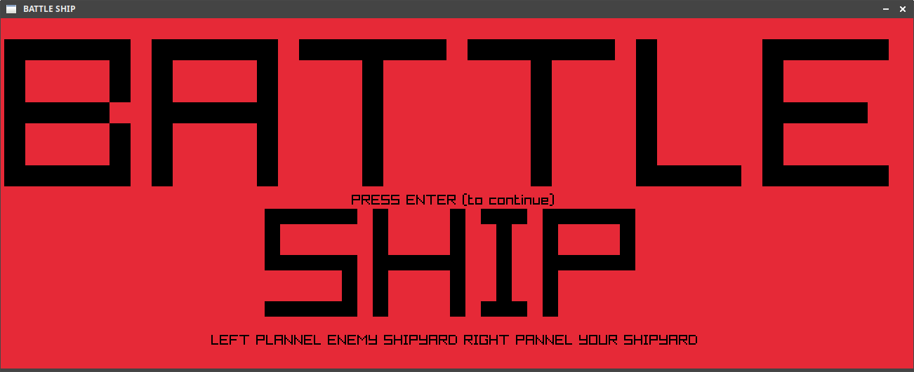

# vikingfacer.github.io

## Current Projects

* Raylib Games 
	* Battleship - the child's game about war. In this project the raylib game library is used to create the game of Battleship. The goal of this project is to build a retro style arcade game modeled after Battleship. Cheesy sound bits, Central Asia National Anthem background music, simple graphics and splash screens. This game is not yet complete but is close to an alpha. 

* Rust Robotics 
	* Alexa Jones - a robot themed with conspiracy theory. Alexa Jones is a robotics project that started out named rustybot. This is because The main language chosen for the project was/is Rust. The robot design to targeted at cheap and boards, Raspberry Pi (Main board) and an Arduino (peripheral board). This project has expained during development to include a controller, peripheral controls, and board to board communication system. 

#Battleship
###Basic BattleShip game build with raylib 

## Screen Shots

# Rust Robotics

* Writings on the Project - The writings for this project are intended to be fun and informational. This is so people with no techinical experience can enjoy them. Even if its just for the jokes and bad analogies.  

[Alexa Jones - Making a Robot](https://medium.com/@jacobmontpetit/alexa-jones-45b2187083fa)

[Alexa Jones — Why Two Boards?](https://medium.com/@jacobmontpetit/alexa-jones-why-two-boards-4b9e28f1b3de)
